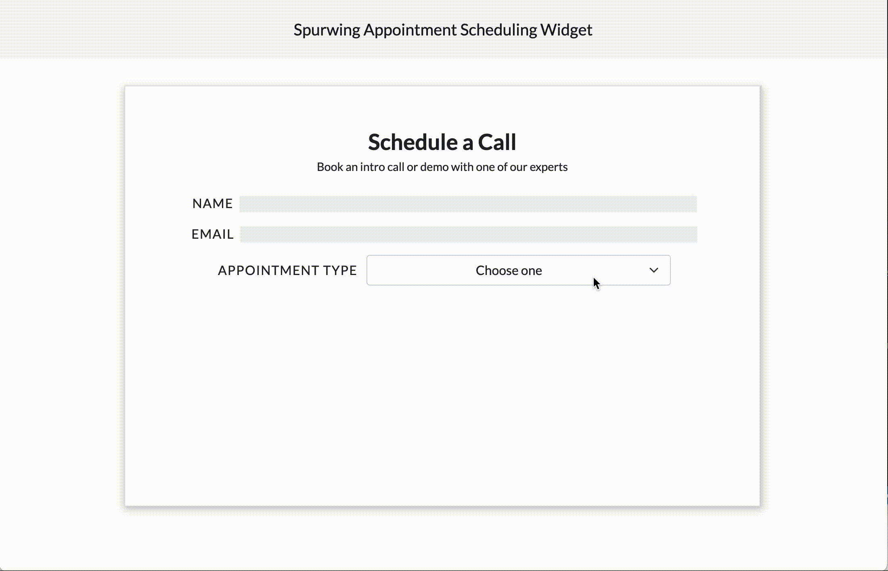
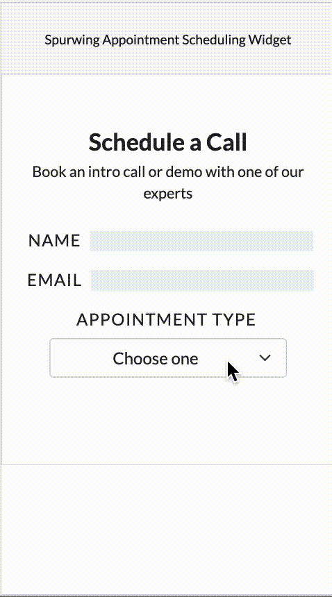

# Appointment Scheduling Widget

## Intro
This project is a simple appointment scheduling widget, built using HTML, CSS, (ES6) JavaScript and jQuery. The used Calendar library is [pg-calendar](https://github.com/KennethanCeyer/pg-calendar). Learn more about the [Spurwing Scheduling API](https://github.com/Spurwingio/Appointment-Scheduling-API).

This widget supports responsive display and mobile environment.

## Usage
- Upload the contents to an HTTP server and visit it using URI with query component (GET request). 
	- key: "pid"
	- value: **provider id**  from your Spurwing account.

		> http://localhost:port/index.html?pid=[provided id]

- Select an appointment type.
- Select an available date on the calendar.
- Select a time slot, enter your name, email address and click confirm.
- Click reschedule button to schedule another appointment.

## Configuration

`index.html`:

 - Variable `SpurwingPID`: **provider id**  from your Spurwing account.
 - Variable `SpurwingAPTID`: **appointment type id** from your Spurwing account. 
 - Variable `SpurwingHookURL`: Optional URL to make a callback to when a user has submitted the booking.

`js/demo.js`:

 - Variable `show_months`: specify how many months to enable for booking (including the current month) on the calendar. This is purely an UI feature and independent from your Spurwing settings.

## Demo
#### Web-based applications
<!---->

#### Mobile-based applications
<!---->

